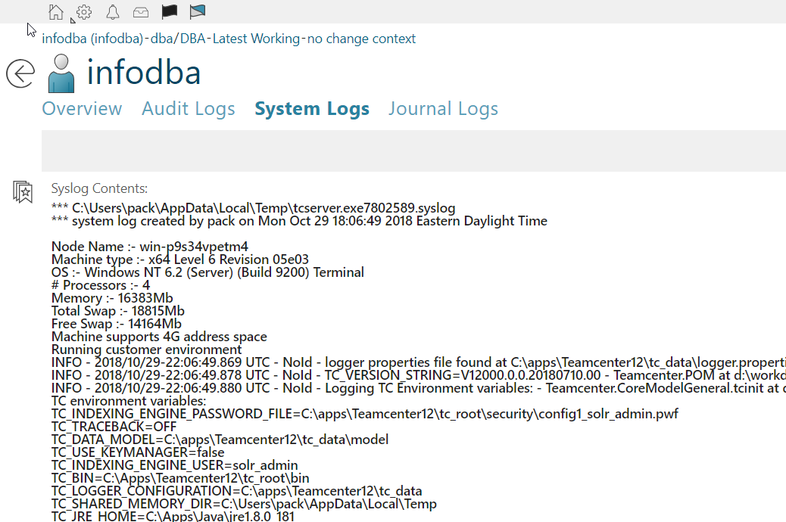

# showSyslog
Show contents of syslog

## usage
Add a new page to a stylesheet.  

For instance, to add to User Profile edit *Awp0UserSummary* stylesheet, and add the snippet below:

    <page titleKey="System Logs">
        <htmlPanel declarativeKey="syslog"/>
    </page>

This will show an additional page on the User Profile, as shown below:

