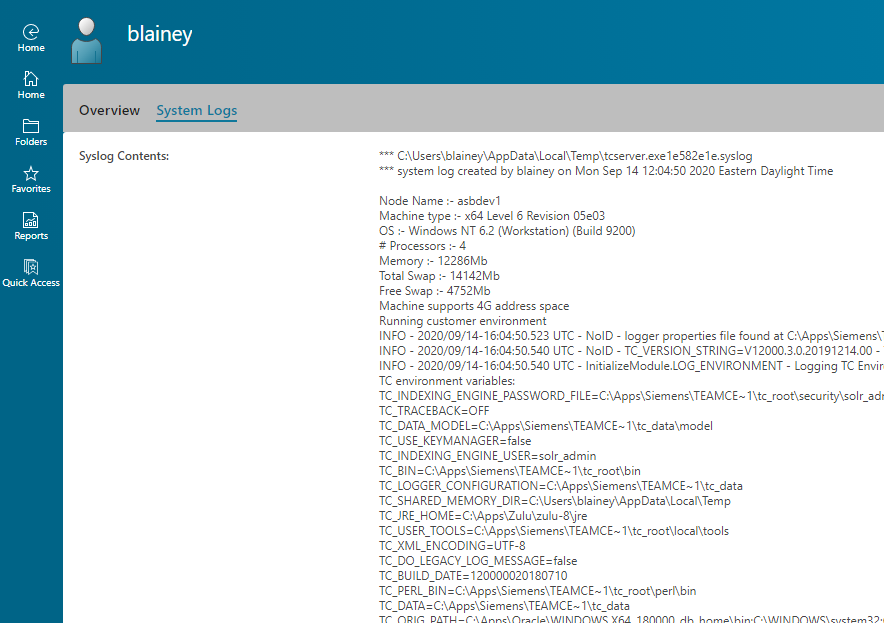

# showSyslog
Show contents of syslog

## version
Active Workspace 4.3

## build
- Create a new folder under `stage/src`, called `showSyslog`.

- Download the contents of this repository to the new folder

- Use `awbuild` to build and publish to the file repo.
    
## usage
After building and publishing the code, add a new page to a stylesheet.  

For instance, to add to User Profile edit *Awp0UserSummary* stylesheet, and add the snippet below:

    <page titleKey="System Logs">
        <htmlPanel declarativeKey="syslog"/>
    </page>

This will show an additional page on the User Profile, as shown below:

